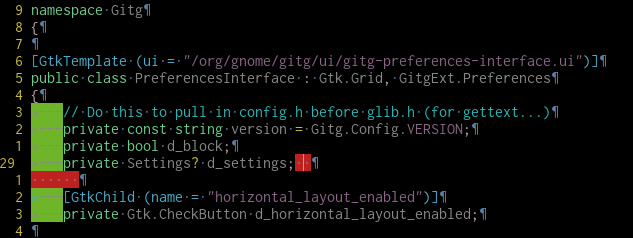

# Whitespace.vim

Manage whitespace with ease. Show tabs, spaces. See warnings of extra whitspace at end or whitespace in emtpy lines



## Description

Toggle view of invisible characters such as tabs, trailing spaces and hard returns. The script includes intuitive presets for these characters, a global environmental variable (g:LIST) that is retained and initialized across sessions if you use a viminfo, and a familiar (to some of us) keyboard shortcut mapping to F4.

If you want to change this shortcut add this in `~/.vimrc`

```vim
let g:creamInvisibleShortCut = "<F4>"
```

This configuration includes characters as nice looking as your specific setup will allow, determined by hardware, operating system and Vim version. (Vim version 6.1.469 supports multi-byte characters, used with UTF-8 encoding.)

## Installation

You can (should) use vundle to install with ease:

```vim
Plugin 'albfan/whitespace.vim'
```

then perform

```vim
:PluginInstall
```

## Credits

- This is a fork of the invaluable http://www.vim.org/scripts/script.php?script_id=363
- This plugin was created from a plugin in Cream project (http://cream.sourceforge.net)
